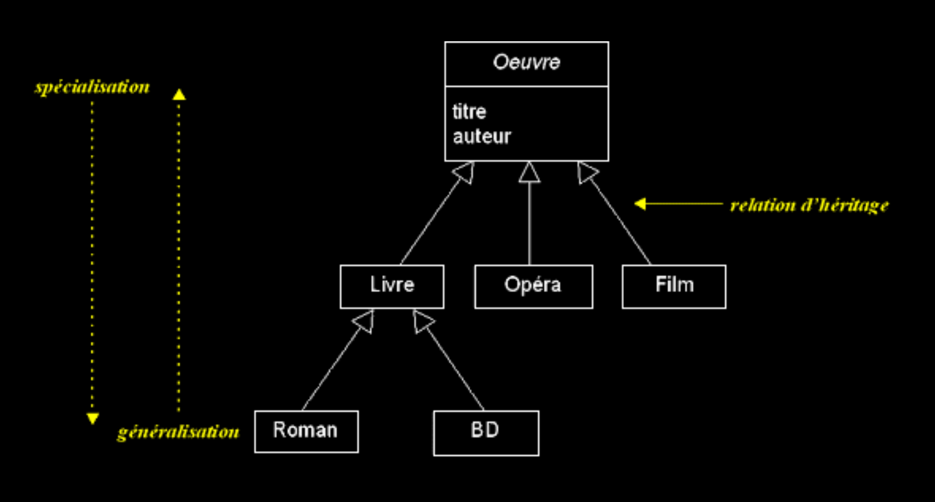
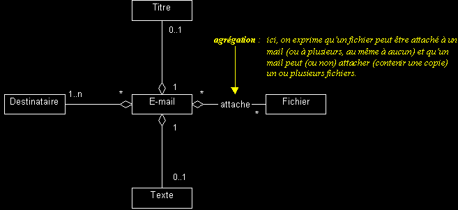
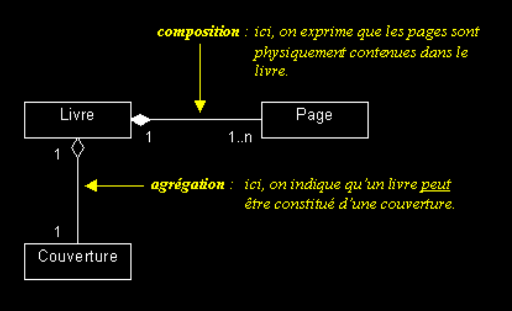

************************
Diagrammes de classe UML
************************

..  admonition:: Source
    :class: important

    Cette section s'inspire largement de la section sur les diagrammes de classe
    du site http://uml.free.fr/cours/ 

Dans cette section, nous allons aborder quelques notions fondamentales de
conception orientée objets et du langage de modélisation UML (Unified Modeling
Language), standard établi en génie logiciel pour concevoir des logiciels.

Le langage UML comprend de nombreuses composantes mais nous allons uniquement
présenter une partie des diagrammes de classes correspondant aux notions
abordées dans le cours.

..  comment::

        Ce serait bien de pouvoir intégrer plantuml à l'avenir pour faire des
        schémas sympathiques dans le cours. Pas seulement diagrammes de classe
        mais également tous les autres diagrammes

    ..  uml::

        skinparam classAttributeIconSize 0
        abstract Class Animal {
        - weight : Float
        - age : Float

        + getWeight(): Float
        + setWeight(w: Float): None
        + tell(): None
        }

        class Pet {
        - name: String
        + getName(): String
        + setName(n: String): None
        }

        class Dog {

        }

        Animal <|-- Pet
        Pet<|-- Dog

Diagrammes de classes
=====================

Nous avons déjà vu quelques diagrammes de classes montrant une hiérarchie
d'héritage entre classes. Mais l'héritage n'est pas la seule relation que
peuvent entretenir différentes classes au sein d'un modèle orienté objets.

Schéma général d'une classe
---------------------------

Une classe est représentée par un rectangle séparé en trois parties :

*   la première partie contient le nom de la classe
*   la seconde contient les attributs de la classe
*   la dernière contient les méthodes de la classe

La seconde et la dernière représentent le comportement de la classe. 

Relation d'héritage
-------------------
 	
Les hiérarchies de classes permettent de gérer la complexité, en ordonnant les
objets au sein d'arborescences de classes, d'abstraction croissante.

    Relation d'héritage entre plusieurs classes

Spécialisation
++++++++++++++

*   Démarche descendante, qui consiste à capturer les particularités d'un ensemble d'objets, non discriminés par les classes déjà identifiées.
*   Consiste à étendre les propriétés d'une classe, sous forme de sous-classes, plus spécifiques (permet l'extension du modèle par réutilisation).
          
Généralisation
++++++++++++++

*   Démarche ascendante, qui consiste à capturer les particularités communes d'un ensemble d'objets, issus de classes différentes.
*   Consiste à factoriser les propriétés d'un ensemble de classes, sous forme d'une super-classe, plus abstraite (permet de gagner en généricité).
          
Classification
++++++++++++++

*   L'héritage (spécialisation et généralisation) permet la classification des objets.
*   Une bonne classification est stable et extensible : ne classifiez pas les objets selon des critères instables (selon ce qui caractérise leur état) ou trop vagues (car cela génère trop de sous-classes).
*   Les critères de classification sont subjectifs.
*   Le principe de substitution (Liksow, 1987) permet de déterminer si une relation d'héritage est bien employée pour la classification :

        "Il doit être possible de substituer n'importe quel instance d'une
        super-classe, par n'importe quel instance d'une de ses sous-classes,
        sans que la sémantique d'un programme écrit dans les termes de la
        super-classe n'en soit affectée."

*   Si Y hérite de X, cela signifie que "Y est une sorte de X" (analogies entre classification et théorie des ensembles).

Relation d'aggrégation
----------------------

    Relation d'aggrégation

*   L'agrégation est une association non symétrique, qui exprime un couplage fort et une relation de subordination.
    Elle représente une relation de type "ensemble / élément".

*   Une agrégation peut notamment (mais pas nécessairement) exprimer :

    *   qu'une classe (un "élément") fait partie d'une autre ("l'agrégat"),
    *   qu'un changement d'état d'une classe, entraîne un changement d'état d'une autre,
    *   qu'une action sur une classe, entraîne une action sur une autre.

*   Une instance d'élément agrégé peut exister sans agrégat (et inversement) :
    les cycles de vies de l'agrégat et de ses éléments agrégés peuvent être
    indépendants.

Composition
-----------

    Relation de composition et d'aggrégation

*   La composition est une agrégation forte (agrégation par valeur).
*   Les cycles de vies des éléments (les "composants") et de l'agrégat sont liés : si l'agrégat est détruit (ou copié), ses composants le sont aussi.
*   A un même moment, une instance de composant ne peut être liée qu'à un seul agrégat.
*   Les "objets composites" sont des instances de classes composées.

Exercices
=========

Exercice 1
----------

..  attention:: 

    Exercice en cours d'élaboration, pas encore terminé

On veut modéliser un établissement scolaire répondant aux critères suivants :

*   Une école (``School``) ... 

    *   possède un nom et une adresse qui sont des attributs publics.
    *   dispose d'un budget donné de type ``MonneyAmount`` qui est un attribut privé.
    *   est composée de différentes classes (``Class``)
    *   peut être du type ``PrimarySchool``, ``SecondarySchool`` ou ``HighSchool``
    *   est dirigé par une équipe de direction (``ManagementBoard``) composée d'un directeur (``head``) et d'adjoints (``associates``) qui sont tous les personnes (``Person``)

*   Une personne (``Person``) possède les attributs suivants

    *   ``firstName : String``
    *   ``lastName : String``
    *   ``birthDate : Date``
    *   ``salary : MonneyAmount``

*   Une classe (``ClassGroup``) ...

    *   possède un nom (public), par exemple ``1Gy02``
    *   contient un groupe d'étudiants (``Student``)
    *   est sous la responsabilité d'un enseignant principal (``Teacher``)
    *   implique un ou plusieurs enseignants
    *   

*   Un étudiant (``Student``) est une personne ``Person`` et ...

    *   appartient à une classe
    *   possède un bulletin scolaire (``ReportCard``)

    
Tutoriels et cours sur l'UML
============================

*   Notation des classes : http://uml.free.fr/cours/i-p13.html
*   Diagrammes de classes : 

    *   http://uml.free.fr/cours/i-p14.html
    *   http://uml.free.fr/cours/i-p15.html
    *   http://uml.free.fr/cours/i-p16.html 

*   Tutoriel plus général sur UML : http://fr.openclassrooms.com/mooc/debutez-analyse-logicielle-avec-uml

Références
==========

*   http://www.ibm.com/developerworks/rational/library/content/RationalEdge/sep04/bell/
*   http://creately.com/blog/diagrams/class-diagram-relationships/
*   http://uml.free.fr/cours/ 