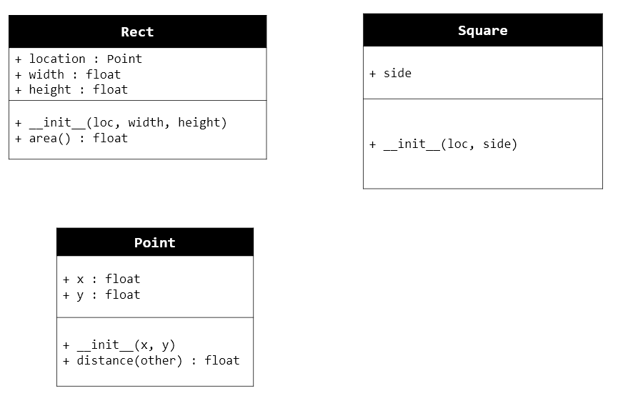
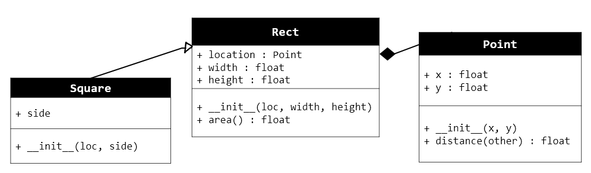

..  header::

    OCI 3, Programmation Orientée Objets,                  Prénom : ....................... / Note : ...........

..  footer::

    Page ###Page### / ###Total###

***************************************
Programmation Orientée Objets : examen écrit
***************************************

..  admonition:: Consignes générales

    *   Barème : ...... / 45 points
    *   Les temps indicatifs pour chaque question sont indiqués
    *   Respecter la syntaxe Python au mieux
    *   Si vous ne parvenez pas à voir comment coder quelque chose en Python, expliquez au mieux les étapes de résolution en pseudo-code et/ou en français.
        
Partie 1 : une bibliothèque de classe
=====================================

Vous êtes développeur chez un éditeur de jeux vidéos qui veut développer son
propre moteur graphique et vous êtes mandaté(e) pour développer une
bibliothèque de classes d'après le diagramme de classe suivant

    Diagramme de classes à compléter

Question 1 (... / 4 points)
-----------

Compléter le diagramme de classes ci-dessus en veillant à y intégrer les
éléments suivants :

a)  Héritage entre les classes ``Rect`` et ``Square``
b)  Composition entre ``Rect`` et ``Point``. L'existence de l'attribut d'instance ``Rect`` est dépendante de l'existence de ``Point``.

..  raw:: pdf

    PageBreak

Question 2 (... / 15 points)
---------------------------

Fonctionnement
++++++++++++++

Vous devrez rendre la question 2 avant de pouvoir passer à la question 3 (Temps conseillé : 10 minutes)

Définir une classe ``Point`` représentant un point du plan cartésien dont
l'utilisation est la suivante dans une session interactive IDLE :

..  code-block:: python

    >>> origine = Point(0,0)
    # indique le nombre d'instances créées
    >>> Point.count()
    1
    >>> p1 = Point(x=3, y=4)
    # indique le nombre d'instances créées
    >>> Point.count()
    2
    >>> p1.x
    10
    >>> p1.distance(origine)
    5
    >>> p1
    'Point (3 ; 4)'
    >>> str(p1)
    'Point (3 ; 4)'
    >>> print(p1)
    Point (3 ; 4)

Indications
+++++++++++

*   Il faut utiliser le théorème de Pythagore pour calculer la distance entre
    deux points du plan.

*   Le module ``math`` contient une fonction ``sqrt`` permettant de calculer
    la racine carrée d'une nombre réel. Veillez à importer le module ``math`` correctement !
        
*   Définir une variable de classe ``count`` et faire en sorte qu'elle
    indique toujours le nombre d'instances créées, comme le montre l'exemple.

Classe ``Point``
++++++++++++++++

Écrire le code de la classe ``Point`` ci-dessous :

..  raw:: pdf

    PageBreak

Question 3 (... / 10 points)
---------------------------

On veut définir une classe ``Rect`` pour représenter une rectangle et une
classe ``Square`` pour représenter un carré selon le diagramme de classe ci-dessous

    Diagramme de classes de la situation

b)  Compléter les classes ci-dessous pour correspondre au diagramme de classe ci-dessus :
    
    ..  code-block:: python

        class Rect(..............):

            def __init__(self, origin, width, height):
            # compléter le code ici

            def area(self):
                # compléter le code ici

        class Square(..................):

            def __init__(self, side):
                # compléter le code ici

            # rajouter des méthodes si nécessaire

            #

    **Exemple d'utilisation**

    ..  code-block:: python

        >>> r = Rect(Point(0,0), 10, 20)
        >>> r.area
        200
        >>> s = Square(Point(15, 15), 30)
        >>> s.area()
        225

..  raw:: pdf

    PageBreak

..  only:: corrige

    ..  admonition:: Solution
    
        ..  code-block:: python

            class Rect(object):

                def __init__(self, origin, width, height):
                    self.origin = origin
                    self.width = width
                    self.height = height

                def area(self):
                    return self.width * self.height

            class Square(Rect):

                def __init__(self, side):
                    super().__init__(self, origin, side, side)

..  raw:: pdf

    PageBreak

..  comment

    Question 4 (... / 10 points)
    ---------------------------

    ..  #admonition:: Fonctionnement

        Vous devrez rendre la question 1 avant de pouvoir passer à la question 2

        *   Temps conseillé : 25 minutes

    Compléter la classe ``RandomPoints`` qui utilise la classe ``Point`` définie
    précédemment :

    Indications
    +++++++++++

    *   La fonction ``random`` du module ``random`` permet de générer des nombres aléatoires entre 0 et 1

    ..  code-block:: python

        class EuclidianPlane(object):

            def __init__(self):
                self.points = []

            def generate(self, n=10, max=1):
                ''' génère aléatoirement ``n`` points dans le plan '''

            def get_num_points(self):
                ''' retourne le nombre de points contenus dans la plan '''
                # à compléter

            def get_max_dist_from(self, ref_point):
                result = ref_point
                max_dist = 0

                for p in self.points:
                    dist = p.distance(ref_point)
                    if cur_dist > max_dist:
                        max_dist = cur_dist
                        result = p

                return max_dist

    ..  only:: corrige

        ..  code-block:: python

            class EuclidianPlane(object):

                #todo 1 point
                origine = Point(0,0)

                def __init__(self):
                    self.points = []

                def generate(self, n=10):
                    self.points = []

                    for i in range(10):
                        self.points += Point(random(), random())

                    return self.points

                def get_num_points(self):
                    #todo 1 point
                    return len(self.points)

                def get_max_dist_from(self, ref_point):
                    result = ref_point
                    max_dist = 0

                    for p in self.points:
                        dist = p.distance(ref_point)
                        if cur_dist > max_dist:
                            max_dist = cur_dist
                            result = p

                    return max_dist

    ..  raw:: pdf
        
        PageBreak

Partie 2 : Compréhension et analyse de code
===========================================

Question 5 (... / 15 points)
----------------------------

#.  On veut augmenter à 36 le nombre de frames par secondes (fps) sans se soucier
    de l'accélération du jeu.

    a)  Indiquer la période de raffraichissement qu'il faut adopter

        ..  raw:: pdf

            Spacer 0 20

    b)  Indiquer le numéro de la ligne à changer et effectuer le changement nécessaire

        ..  raw:: pdf

            Spacer 0 20

#.  Définir la notion de variable de classe et mettre en évidence un exemplaire dans le code        

    ..  raw:: pdf

        Spacer 0 50

#.  Définir la notion de variable d'instance et mettre en évidence un exemplaire dans le code

    ..  raw:: pdf

        Spacer 0 50
    
#.  Définir la notion de méthode de classe et indiquer les différences avec une méthode d'instance

    ..  raw:: pdf

        Spacer 0 50
    
#.  Expliquer en quoi consiste le mécanisme de polymorphisme et indiquer comment le code du Frogger y fait recours

    ..  raw:: pdf

        Spacer 0 50
    
#.  Expliquer à quoi sert la méthode ``act`` de la classe ``Car`` et comment / quand cette méthode est appelée

    ..  raw:: pdf

        Spacer 0 50
    
#.  Expliquer à quoi sert l'instruction ``delay(100)`` à la ligne 46.

    ..  raw:: pdf

        Spacer 0 50
    
#.  Pourrait-on toujours jouer à Frogger si la ligne n'était pas présente? Justifier!

    ..  raw:: pdf

        Spacer 0 50

Code à analyser
---------------

..  code-block:: python
    :include: frogger-analyse.py
    :linenos:

..  only:: html

    ..  literalinclude:: frogger-analyse.py
        :language: python
        :linenos: