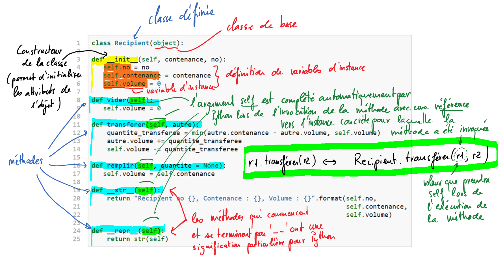

********
Apprentissage par l'exemple
********

Un bon exemple vaut mieux qu'on long discours pour cerner immédiatement les
différentes notions de base de la programmation orientée  objets. Enfilez vos
meilleures lunettes (ou lentilles) et observez attentivement le code suivant
qui montre comment définir une nouvelle classe ``Recipient`` qui dérive de la
classe de base ``object`` :

..  code-block:: python
    :linenos:

    class Recipient(object):

    def __init__(self, contenance, no):
       self.no = no                         
       self.contenance = contenance
       self.volume = 0

    def vider(self):
       self.volume = 0

    def transferer(self, autre):
        quantite_transferee = min(autre.contenance - autre.volume, self.volume)
        autre.volume += quantite_transferee
        self.volume -= quantite_transferee
    
    def remplir(self, quantite = None):
       self.volume = self.contenance

    def __str__(self):
        return "Récipient no {}, Contenance : {}, Volume : {}".format(self.no,
                                                                      self.contenance,
                                                                      self.volume)

    def __repr__(self):
        return str(self)

Analyse du code
===============

Utilisation de la classe
========================

Pour pouvoir utiliser une classe, il faut créer un ou plusieurs objets de
cette classe. En terme techniques, on dit qu'on crée une **instance** de la
classe ou qu'on **instancie** la classe. Ainsi, après avoir défini la classe à
l'aide du mot-clé ``class``, on peut créer des récipients différents.

::

    >>> r1 = Recipient(no = 1, contenance = 4) 
    >>> r2 = Recipient(no = 2, contenance = 3) 

À l'aide de ces deux lignes, ont vient de créer deux objets concrets
(instances) de la classe ``Recipient`` (on pourrait dire du *type*
``Recipient``). En effet, notre classe ``Recipient`` constitue un nouveau type
de données utilisable dans notre programme.
     
    >>> r2.remplir() # remplir le recipient r2 
    >>> r1.transferer(r2) # transfère le contenu de r2 dans r1 
    >>> r2.vider() # vider le récipient r2 
    >>> r2.volume 
    0 
    >>> r1.volume 
    3 
    ... 
    >>> r2.volume == 2 # ce que l’on devrait obtenir à la fin ... 
    True 