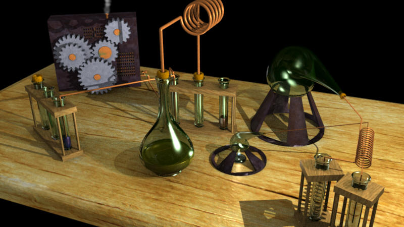
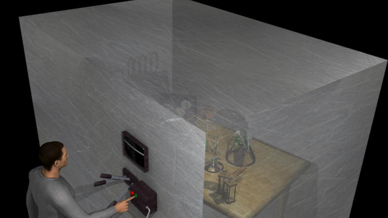
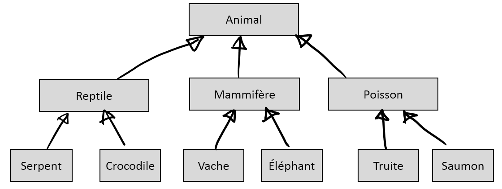

****************
Concepts de base
****************

Objet = attributs + méthodes
============================

La programmation orientée objet (Object Oriented Programming ou OOP) permet de
structurer les logiciels complexes en les organisant comme des ensembles
d'objets qui interagissent entre eux et avec le monde extérieur. L'idée de
base de la programmation orientée objet consiste à regrouper dans un même
ensemble (l'objet), à la fois un certain nombre de données (les attributs
d'instance) et les algorithmes destinés à effectuer divers traitements sur ces
données (les méthodes) :

..	centered::	Objet = [attributs + méthodes]

Cette façon d'associer dans une même "capsule" les *propriétés* d'un objet et
les fonctions qui leur permettent d'interagir avec le monde extérieur,
correspond chez les concepteurs de programmes à une volonté de construire des
entités informatiques dont le comportement se rapproche du comportement des
objets du monde réel.

..	Considérons par exemple un widget "bouton" dans une application graphique. Il nous paraît raisonnable de souhaiter que l'objet informatique que nous appelons ainsi ait un comportement qui ressemble à celui d'un bouton d'appareil quelconque du monde réel. Or nous savons que la fonctionnalité d'un bouton réel (sa capacité de fermer ou d'ouvrir un circuit électrique) est bien intégrée dans l'objet lui-même (au même titre que d'autres propriétés, telles que sa taille, sa couleur, etc.) De la même manière, nous souhaiterons que les différentes caractéristiques de notre bouton logiciel (sa taille, son emplacement, sa couleur, le texte qu'il supporte), mais aussi la définition de ce qui se passe lorsqu'on effectue différentes actions de la souris sur ce bouton, soient regroupés dans une entité bien précise à l'intérieur du programme, de telle sorte qu'il n'y ait pas de confusion entre ce bouton et un autre, ou a fortiori entre ce bouton et d'autres entités.

Les **classes** sont les principaux outils de la programmation orienté objet
et consistent en la définition des caractéristiques et des comportements
propres à tous les objets d'une même famille. Ainsi, une classe est avant tout
une structure de données dans la mesure où il s'agit d'une entité chargée de
gérer, classer et stocker des données sous une certaine forme. La principale
différence entre une classe et une quelconque structure de données réside dans
le fait qu'une classe regroupe des données, sous la forme d'attributs, mais
également le moyen de les traiter, sous la forme de méthodes.

En résumé, une classe peut être identifiée à un *moule* utilisé pour créer des
objets d'une même famille.  Ce moule se compose d'attributs, des données
représentant l'état de l'objet, et de méthodes, des opérations applicables aux
objets. Un objet, appelés également instance de classe, est dès lors la
réalisation concrète d'une classe possédant des caractéristiques qui leur sont
propres. Par exemple, une maison est une instance particulière d'un plan la
définissant :

..	figure:: figures/architecte-maison.png
	:align: center
	:width: 50%

Apports de la programmation orientée objets
===========================================

Encapsulation
-------------

Le premier bénéfice de la programmation orientée objet réside dans le fait que
les différents objets utilisés peuvent être construits indépendamment les uns
des autres (par exemple par des programmeurs différents) sans qu’il n’y ait de
risque d’interférence. Ce résultat est obtenu grâce au concept **d’encapsulation**
: la fonctionnalité interne de l’objet et les variables qu’il utilise pour
effectuer son travail, sont en quelque sorte « enfermées » dans l’objet. Les
autres objets et le monde extérieur ne peuvent y avoir accès qu’à travers des
procédures bien définies : l’**interface** de l’objet. Ainsi, de l'extérieur, un
objet est perçu comme une boîte noire ayant certaines propriétés et un
comportement spécifié. Cette boite noire établit une séparation entre la
fonctionnalité d'un objet et la manière dont cette fonctionnalité est
réellement implémentée dans l'objet :

	Outils de laboratoires : accès direct

	Outils de laboratoires : accès par une interface

L'encapsulation consiste donc à garantir l'intégrité des données contenues
dans l'objet en s'assurant que son utilisateur ne puisse pas modifier des
attributs clés ou manipuler incorrectement l'objet sans passer par le contrôle
de l'interface. L'usage d'un objet à travers son interface permet d'en
simplifier la manipulation tout en évitant à son utilisateur de devoir savoir
faire appel aux mécanismes fondamentaux régissant son fonctionnement.

Héritage
--------

Un second bénéfice résultant de l’utilisation des classes est la possibilité
qu’elles offrent de *construire de nouveaux objets* à partir d’objets
préexistants, et donc de réutiliser des pans entiers d’une programmation déjà
écrite (sans toucher à celle-ci !), pour en tirer une fonctionnalité nouvelle.
Cela est rendu possible grâce aux concepts de dérivation et de
**polymorphisme** :

Polymorphisme
-------------

Le polymorphisme permet d’attribuer des comportements différents à des objets
dérivant les uns des autres, ou au même objet ou en fonction d’un certain
contexte. En proposant d'utiliser un même nom de méthode pour plusieurs types
d'objets différents, le polymorphisme permet une programmation beaucoup plus
générique. Le développeur n'a pas à savoir, lorsqu'il programme une méthode,
le type précis de l'objet sur lequel la méthode va s'appliquer. Il lui suffit
de savoir que cet objet implémentera la méthode.

..	admonition:: En savoir plus

	Consulter les références suivantes :

	*	http://www.commentcamarche.net/contents/811-poo-le-polymorphisme
