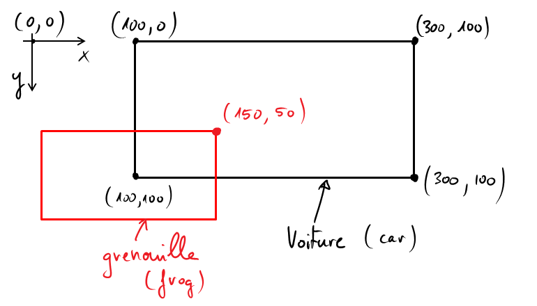
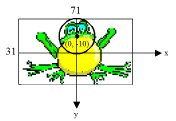

***************
Jeux d'arcades (Gestion du clavier / conception de jeux)
***************

Objectifs
=========

Dans cette section, tu vas apprendre les éléments suivantes

*   Comment réaliser un jeu d'arcades bien connu : Frogger
*   Comment gérer les événements du clavier grâce aux *callbacks*
*   Gestion des collisions entre les objets du jeu
*   Raffraichissement rapide et fluide (25 fps) de l'image
*   Comment développer un jeu un peu plus compliqué (environ 100 lignes de code)

Matériel
========

Dans cette section, la base du code du jeu sera développée pas-à-pas. Une
version imprimable du code a été distribuée en cours.

..  admonition:: Téléchargement

    *   :download:`scripts/frogger/handout-code.pdf`

Scénario du jeu et cahier des charges
=====================================

..  only:: html
    
    ..  figure:: figures/frogger.gif
        :align: center

Avant de se lancer dans le codage d'un jeu, il faut définir clairement les
règles et les fonctionnalités qu'il devra mettre à disposition. En somme, il
faut écrire le scénario du jeu. En génie logiciel et dans la gestion de
projet, cela s'appelle "dresser le cahier des charges" du projet. Il s'agit
d'un document qui décrit de manière succincte, par des mots-clés et des
phrases très courtes, mais dans les détails, toutes les fonctionnalités
désirées dans le produit fini.

La plupart du temps, le premier scénario projeté  est trop compliqué et il ne
sera pas possible de l'implémenter du premier coup. Le programmeur doit donc
simplifier le cahier des charges du jeu (logiciel) jusqu'à ce qu'il soit en
mesure de l'implémenter pour une version 0.1. Il sera ensuite possible de
rajouter des règles, des variantes, des effets et fonctionnalités
supplémentaires. Cela nécessite cependant d'écrire le code de façon modulable
et bien structurée pour pouvoir rajouter les fonctionnalités ultérieures avec
le minimum de modifications. Un développement intelligent qui permet un code
flexible et évolutif  constitue un véritable défi même pour les meilleurs
programmeurs.

Cependant, développer son propre jeu / programme et pouvoir l'exécuter est
extrêmement gratifiant, surtout s'il est utile et apprécié par d'autres
personnes. Dans notre cas, ce n'est pas tant le produit fini que les
compétences et les connaissances que tu vas acquérir pendant le développement
(et le débogage !!!)

Cahier des charges
------------------

..  admonition:: À compléter

    Le cahier des charges se trouve dans le document GoogleDocs modifiable suivant : https://docs.google.com/document/d/1zaWUF-Erd_0qmbAar9z98FhnQ4RvtNIJERj7RTOalg8/edit?usp=sharing.
    N'hésitez pas à rajouter des fonctionnalités que vous trouverez
    intéressantes en couleur rouge.

Principes de développement
==========================

Étape 1
-------

Il y a plusieurs façons de créer un petit jeu tel que Frogger. Voici celle que
nous allons adopter :

#.   D'abord les mouvements de la grenouille et ceux des véhicules
#.   Gestion des collisions
#.   Comptage des points et gestion de la fin du jeu
    
Les voitures sont représentées par des instances de la classe ``Car`` qui
dérive de la classe ``Actor``. Dans leur méthode ``act()``, on programme la
direction dans laquelle elles se déplacent. On utilisera les sprites
``car0.gif`` jusqu'à ``car19.gif`` qui se trouvent dans l'archive TigerJython.
Il est possible d'utiliser tes propres images, mais leur taille ne doit pas
dépasser 70 pixels de hauteur et 200 pixels de largeur.

Pour les jeux d'arcades, on utilise généralement une grille de jeu dont la
taille des carrés est 1x1 pixel, ce qui fait correspondre chaque carré de la
grille à un pixel de l'écran. Nous utiliserons une grille de taille :math:`800 \times 600`
pour commencer, ce qui paraîtra un peu petit sur des écrans haute définition.
Dans la fonction ``initCars()``, tu peux générer les 20 véhicules en
déterminant leur lieu de création et leur sens de déplacement.

Le déplacement des véhicules avec la méthode ``act()`` est simple : dès qu'ils
sortent de la grille de jeu d'un côté, tu peux les faire réapparaitre de
l'autre côté. Il faut noter à cet effet que l'acteur existe encore dans le
moteur du jeu même s'il se trouve en dehors de la grille. Il est donc possible
de le faire apparaître de l'autre côté de la grille, mais en dehors de la zone
visible.

Code de base
++++++++++++

..  literalinclude:: scripts/frogger/frogger1.py
    :linenos:
    :language: python

Étape 2 (Bouger la grenouille avec le clavier)
----------------------------------------------

Nous allons maintenant faire intégrer la grenouille dans le jeu. Le joueur la
bougera grâce aux touches haut, bas, gauche, droite du clavier. Ensuite, il
faut faire le suivant :

*   Définir une classe ``Frog`` qui dérive de la classe ``Actor``. Aucune
    méthode n'est nécessaire hormis le construteur puisque ce seront des événements
    clavier qui vont la faire bouger.

*   Définir le gestionnaire d'événements ``keyCallback()`` qui sera signalé au
    moteur de jeu comme gestionnaire d'événements du clavier avec 

    ..  code-block:: python

        makeGameGrid(..., keyRepeated=keyCallback)

    On associe le gestionnaire ``keyCallback`` au paramètre ``keyRepeated``
    pour qu'il ne soit pas uniquement appelé de manière unique lorsqu'on
    appuie courtement sur une touche, mais qu'il le soit de manière rapide et
    répétée lorsque la touche est maintenue enfoncée.

    ..  tip::

        Attention à **ne pas mettre de parenthèses** lorsque le gestionnaire est passé
        en paramètre à la fonction ``makeGameGrid``. Il faut bien passer la
        fonction en tant qu'objet et non sa valeur de retour avec ``makeGameGrid(...)``

*   Dans le gestionnaire ``keyCallback``, le paramètre ``keyCode`` sera
    renseigné avec le code (nombre entier) de la touche pressée. Il suffit de
    déplacer la grenouille de 5 pixels dans la direction indiquée sur la base
    de ``keyCode`` ou de ne rien faire si une autre touche a été pressée.

    Pour augmenter la lisibilité du programme, on définit les constantes
    constantes suivantes en début de code:

    ..  code-block:: python

        # ---------------- Constantes clavier --------
        K_LEFT      = 37
        K_UP        = 38
        K_RIGHT     = 39
        K_DOWN      = 40

    ..  tip:: 

        Si tu ne connais pas le ``keyCode`` d'une touche du clavier, il suffit
        d'essayer en exécutant ce programme qui fait appel à un gestionnaire
        d'événements affichant le code reçu avec un ``print`` :

        ..  literalinclude:: scripts/testkbd.py
            :language: python

Code
++++

..  literalinclude:: scripts/frogger/frogger2.py
    :linenos:
    :language: python

Détection de collisions
=======================

Il est très facile d'installer une détection des collisions avec le module
*JGameGrid* car il s'occupe de faire les calculs géométriques pour nous. Il
suffit, lors de la création d'une instance ``car`` de la classe ``Car``,
d'appeler la méthode ``addCollisionActor`` de la grenouille :

..  code-block:: python
    
    frog.addCollisionActor(car)

Cet appel va indiquer à l'instance ``frog`` de la classe ``Frog`` que lors de
chaque collision avec l'acteur ``car``, elle doit générer un événement spécial
qui va se charger d'invoquer la méthode ``Actor.collide()`` de l'instance
``frog``. C'est dans cette méthode qu'on peut ensuite décider de la manière de
réagir à la collision, en l'occurrence faire sauter la grenouille à sa
position de départ.

Code
++++

..  literalinclude:: scripts/frogger/frogger3.py
    :linenos:
    :language: python
    :emphasize-lines: 14-16,33-33

La méthode ``collide()``
------------------------

La méthode ``collide()`` est définie à la base dans la classe ``Actor``
sans comportement particulier et doit être surchargée (*overriden*) dans
la classe ``Frog`` pour implémenter le comportement désiré.

Par défaut, la détection se fait par calcul géométrique avec les
coordonnées des sommets des rectangles entourants les sprites, comme
représenté sur la figure ci-dessous :

    Illustration de la détection de collision avec la méthode des
    rectangles

Il est possible de personnaliser ce comportement en précisant la région de
l'espace qui sera prise en compte pour la détection de la superposition.
Voici les méthodes utiles à cet effet permettant de spécifier la forme, la
taille et les coordonnées de la zone du sprite sensible à la collision :

*   ``setCollisionCircle(centerPoint, radius)`` :  Cercle de centre ``centerPoint`` et de rayon ``radius`` (en pixels)

*   ``setCollisionImage()`` : Nicht-transparente Bildpixels (nur mit einem Partner der Kreis, Linie oder Punkt als Kollisionsarea hat)
    
*   ``setCollisionLine(startPoint, endPoint)`` : Segment de droite dont les extrémités sont les points ``startPoint`` et ``endPoint``

*   ``setCollisionRectangle(center, width, height)`` : Rectangle de centre ``center``, de largeur ``width`` et de hauteur ``height``

*    ``setCollisionSpot(spotPoint)`` : Un point particulier de l'image 
     
..  admonition:: Remarque

    Pour toutes les méthodes décrites ci-dessus, le système de coordonnées
    utilisé est relatif au sprite. Son origine se trouve au centre du
    rectangle délimitant le sprite et l'axe :math:`Oy` est dirigé vers le bas :

    ..  figure:: figures/actor-relative-axis.png
        :align: center
        :width: 50%

        Système d'axe relatif au sprite

Le sprite de la grenouille a une taille de :math:`71 \times 41` pixels. On
peut changer la zone de la grenouille sensible aux collisions dans le
construteur de la classe ``Frog`` :

..  code-block:: python
    
    self.setCollisionCircle(Point(0, -10), 5)

de sorte qu'une collision sera générée lorsqu'une voiture roule sur le cercle
de centre :math:`(0;-15)` et de rayon :math:`5` qui entoure sa tête :

    ..  comment-list-table::
        :header-rows: 1

        *   - Méthode
            - Zone de collision
                  
        *   - ``setCollisionCircle(centerPoint, radius)``
            - Cercle de centre ``centerPoint`` et de rayon ``radius`` (en pixels)
        
        *   - ``setCollisionImage()``
            - Nicht-transparente Bildpixels (nur mit einem Partner der Kreis, Linie oder Punkt als Kollisionsarea hat)
            
        *   - ``setCollisionLine(startPoint, endPoint)``
            - Segment de droite dont les extrémités sont les points ``startPoint`` et ``endPoint``

        *   - ``setCollisionRectangle(center, width, height)``
            - Rectangle de centre ``center``, de largeur ``width`` et de hauteur ``height``

        *   -  ``setCollisionSpot(spotPoint)``
            - Une point particulier de l'image 

Moteur de jeu
=============

Maintenant que nous avons développé tout ce qui tourne autour des mouvements
des acteurs de notre jeu, il nous faut implémenter la logique du jeu, à savoir
le comptage des points et les conditions de fin de jeu.

Pour ce faire, on pourrait utiliser des variables globales pour stocker le
nombre de fois que la grenouille a traversé avec succès toute la route et le
nombre de fois que la grenouille a été écrasée. 

Si la grenouille a trois vies, on peut stoper le jeu et afficher un message de
*Game Over* lorsqu'elle s'est faite écraser trois fois.

Mais comme vous le savez, l'utilisation de variables globales n'est pas
indiquée dans le 99% des cas et le nôtre ne fait pas exception. Le mieux
serait de créer une classe ``FroggerGame`` qui va stocker ces différents
paramètres en tant que variables d'instances.

    

Extensions / Exercices
======================

#.  Créer une nouvelle classe ``FroggerGame`` pour pour modéliser le moteur de jeu dans
    une classe qui constituera le programme principal. Il ne doit y avoir aucune
    variable dans l'espace de noms global.

    ..  admonition:: Consignes

        *   La grenouille a trois vies
        *   À chaque fois que la grenouille traverse la route, augmenter un compteur ``nb_succes``
            défini judicieusement
        *   À chaque fois que la grenouille se fait écraser, diminuer le nombre de vies de 1
        *   Afficher dans le titre de la fenêtre le nombre de succès et le nombre de vies restantes
            
    ..  admonition:: Indications

        *   On peut afficher la chaine ``texte`` dans la barre de titre de la fenêtre avec 
            
            ::

                setTitle(texte)

        *   On peut mettre le jeu en pause avec 
            
            :: 

                doPause()

        *   On sait que la fenêtre principale a été fermée lorsque ``isDisposed() == True``
        *   Pour afficher le *Game Over*, on peut créer un acteur ``gameOver`` avec le sprite ``"sprites/gameover.gif"`` ou avec un sprite personnalisé dont le fond est transparent.

    ..  admonition:: Code de base

        ..  literalinclude:: scripts/frogger/exo_01_base.py
            :linenos:
            :language: python

#.  Jouer le son ``"wav/boing.wav"`` lorsque la grenouille se fait écraser et le
    son ``"wav/notify.wav"`` lorsqu'elle parvient avec succès à traverser la route.

#.  Changer le code pour pouvoir bouger la grenouille avec les touches ``A``, ``S``, ``D``, ``W``,
    au lieu des touches "flèches" du clavier
     
#.  Faire un comptage de points qui sera affiché dans la barre de titre de la
    fenêtre.

    *   Lorsque la grenouille traverse avec succès, le joueur marque 5 points.
    *   Lorsque la grenouille se fait écraser, le joueur perd 5 points

#.  Inclure un temps limite pour chaque traversée de la route. Si le temps est
    dépassé, supprimer 10 points et remettre la grenouille au point de départ.

#.  Fais en sorte que les voitures ne roulent pas à la même vitesse sur
    toutes les voies.

#.  Au lieu d'avoir un décallage régulier entre les voitures, introduis
    une distance aléatoire comprise entre 20 et 100 pixels. 

#.  Sois créatif et ajoute tes propres fonctionnalités au jeu.
