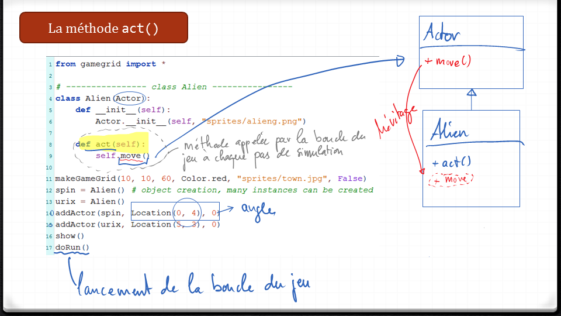

**************************************
Encore des objets, rien que des objets
**************************************

Introduction
============

Dans la vie de tous les jours, vous êtes entouré par une quantité d'objets.
Parce que le logiciel est un modèle qui reflète souvent une certaine réalité,
il est naturel d'introduire des objets dans l'informatique. C'est ce qu'on
appelle la programmation orientée objet (POO). Ce **paradigme de
programmation** s'est imposé depuis deux décennies dans le génie logiciel, à
tel point qu'il est impensable aujourd'hui de développer un projet
informatique sans passer en n'utilisant pas la programmation orientée objets.
Dans ce chapitre, vous allez apprendre à maitriser les concepts principaux de
cette manière de penser et de programmer en développant quelques jeux célèbres.

Sans le savoir, vous avez déjà rencontré plusieurs objets dans votre vie de
programmeur/se : les chaines de caractères, listes, dictionnaires et tuples en
sont de bons exemples.

..
    Vous avez déjà rencontré comme un objet de la tortue . Une tortue a des
    propriétés ( il a une certaine couleur , est situé à une certaine position et
    a un point de vue particulier ) et des capacités ( il peut aller de l'avant ,
    tourner , etc.) Dans la POO objets sont regroupés avec des caractéristiques et
    des capacités similaires dans les classes . Les objets appartiennent à la
    Tortue Tortue de classe , on dit aussi , sont des instances de la tortue de
    classe . Pour créer un objet , vous devez définir une classe ou utiliser une
    classe pré- définie comme tortues premier .

    Lorsque la programmation est appelé les propriétés des attributs aussi ou
    variables d'instance , les compétences et les opérations ou méthodes . Il
    existe des variables et des fonctions , à l'exception qu'ils appartiennent à
    une classe particulière et donc « encapsulés » dans la classe . Pour
    l'utiliser en dehors de la classe , vous devez préfixer une instance de la
    classe et de l'opérateur point ``.``.

Présentation de l'IDE TigerJython
=================================

La vidéo suivante présente l'environnement de développement *TigerJython* et les
différents éléments son interface graphique.

..  only:: html

    ..  youtube:: zlR7H_zRl3I

``JGameGrid`` : notre espace jeux
=================================

Sans POO, il n'est pas possible de créer un jeu d'ordinateur sans se prendre
la tête, car le concepteur de jeux va forcément traiter les personnages du jeu
et les autres objets du plateau de jeu comme des objets. Le plateau de jeu est
une fenêtre d'écran rectangulaire modélisée par la classe ``GameGrid`` de la
Bibliothèque de jeux ``JGameGrid``. Avec un appel à la fonction
``makeGameGrid()``, on construit une *instance* (un exemplaire) de la classe
``GameGrid`` et la méthode ``show()`` permet d'afficher la fenêtre à l'écran.
Il est possible de personnaliser  l'apparence de la fenêtre de jeu avec des
paramètres appropriés

Création de la grille de jeu
----------------------------

Tous les programmes utilisant ``gamegrid`` partagent certains ingrédients de
base que montrent le code ci-dessous qui se contente de créer la grille de
jeux et de l'afficher dans une fenêtre.

..  only:: html

    ..  youtube:: TXPnTpMipDY

Résumé
++++++

Avec ``makeGameGrid(10, 10, 60, Color.red, "sprites/town.jpg", False)``, on
peut afficher une fenêtre dans laquelle on pourra développer nos jeux.

*   Les trois premiers paramètres indiquent que la fenêtre va contenir une
    grille de :math:`10 \times 10` cellules carrées qui font 60 pixels de côté.

*   Le paramètre ``Color.red`` crée le grillage rouge qui montre la grille pendant la phase de
    développement mais il est possible de le supprimer par la suite.

*   Le fichier image ``sprites/town.jpg`` correspond au fond d'écran sur lequel va se dérouler le jeu

*   Le dernier paramètre gère l'affichage de la barre de navigation qui n'est pas nécessaire dans cet exemple
        

..  admonition:: Exécuter le code

    Pour exécuter les codes Python présentés dans ce chapitre, il faut les
    coller dans l'environnement *TigerJython* qui est un Python légèrement
    modifié suivant la version 2.7 du langage.

    Pour vous assurer que tout fonctionne correctement, essayez d'exécuter le code suivant dans *TigerJython* :

    ..  code-block:: python

        from gamegrid import *

        makeGameGrid(10, 10, 60, Color.red, "sprites/town.jpg", False)
        show()

..  admonition:: Memo

    Les méthodes de la classe ``GameGrid`` sont mises à ta disposition par la
    fonction ``makeGameGrid()``. Il est cependant également possible de créer
    une instance de ``GameGrid`` et d'appeler ses méthodes en utilisant
    l'opérateur point.

    ::

        from gamegrid import *

        gg = GameGrid(10, 10, 60, Color.red, "sprites/town.jpg", False)
        gg.show()

    *   La fenêtre de jeu est faite de cellules carrées de 60 pixels de côté.
    *   Il y a 10 cellules horizontales et 20 cellules verticales
    *   Puisque les lignes de la grilles sont affichées également tout en bas et tout à droite, la fenêtre a une taille de 601 x 601 pixels.
        Cela correspondant à la taille minimale de l'image d'arrière-plan
    *   Le dernier paramètre booléen détermine si une barre de navigation apparaît.

Création de nouveaux personnages dérivés de la classe ``Actor``
---------------------------------------------------------------

Les jeux que nous allons développer font intervenir des personnages, plus
précisément des *sprites* qui sont appelés *acteurs* dans la philosophie de la
GameGrid. Pour créer un nouveau personnage, il faut donc créer une nouvelle
classe qui dérive de la classe ``Actor``.

La vidéo ci-dessous montre comment créer une nouvelle classe ``Alien`` qui
dérive de la classe ``Actor`` pour représenter les aliens qui vont tomber du
ciel dans notre jeu qui va évoluer en une sorte de *Space Invader* très
simplifié.

Code à étudier
++++++++++++++

..  code-block:: python
    :linenos:

    from gamegrid import *

    # ---------------- class Alien ----------------
    class Alien(Actor):
        def __init__(self):
            Actor.__init__(self, "sprites/alien.png")

        def act(self):
            self.move()

    makeGameGrid(10, 10, 60, Color.red, "sprites/town.jpg", False)
    spin = Alien() # object creation, many instances can be created
    urix = Alien()
    addActor(spin, Location(2, 0), 90)
    addActor(urix, Location(5, 0), 90)
    show()
    doRun()

Analyse du code
+++++++++++++++

..  only:: html

    ..  only:: html

        ..  youtube:: L-RFwlpI_m0

Résumé
++++++

Voici un résumé de l'analyse de code effectuée dans la vidéo. Prenez le temps
de bien comprendre chaque élément de ce code :

..  figure:: figures/def-classe-alien.png
    :width: 100%
    :align: center

    Création d'une classe ``Alien`` qui dérive de ``Actor``

Bien comprendre comment fonctionne la méthode ``act()`` des acteurs
-------------------------------------------------------------------

La méthode ``act()`` définie dans l'interface de la classe ``Actor`` doit être
réimplémentée (surchargée) dans les classes qui dérivent de la casse
``Actor``. Tout acteur personnalisé doit donc définir cette méthode ``act()``
qui spécifie ce que doit faire l'acteur à chaque cycle de la simulation
(boucle du jeu). Cette méthode sera donc appelée par exemple toutes les 30
millisecondes pour déplacer l'acteur à son prochain emplacement dans la
grille.

La méthode ``move()`` appelée par la méthode ``act()`` est une
méthode d'instance qui n'est cependant pas définie dans la classe ``Alien``.
Celle-ci est définie plutôt dans la classe de base ``Actor`` et héritée par la
classe dérivée ``Alien`` (cf. figure :ref:`fig-explication-methode-act`)

..  only:: html

    ..  only:: html

        ..  youtube:: IZXbmaCOEw4

Résumé de la vidéo
++++++++++++++++++

Voici de quoi comprendre le code analysé dans la vidéo :

..  _fig-explication-methode-act:

Space Invader Light
-------------------

Nous allons compléter notre petit programme pour pouvoir éliminer les aliens
qui tombent en leur cliquant dessus. Pour cela, il faut créer un gestionnaire
d'événement, matérialisé dans notre code par la fonction ``pressCallback(e)``.
Cette fonction est connectée aux événements de clic sur la souris (bouton
gauche) par le dernier paramètre ``mousePressed = pressCallback`` à la ligne
20 :

::

    makeGameGrid(10, 10, 60, Color.red, "sprites/town.jpg", False,
             mousePressed = pressCallback)

Code Python
+++++++++++

..  code-block:: python
    :linenos:

    from gamegrid import *
    import random

    # ---------------- class Alien ----------------
    class Alien(Actor):
        def __init__(self):
            Actor.__init__(self, "sprites/alien.png")

        def act(self):
            self.move()

    def pressCallback(e):
        location = toLocationInGrid(e.getX(), e.getY())
        actor = getOneActorAt(location)
        if actor != None:
            removeActor(actor)
        refresh()

    makeGameGrid(10, 10, 60, Color.red, "sprites/town.jpg", False,
                 mousePressed = pressCallback)
    setSimulationPeriod(800)
    show()
    doRun()

    while not isDisposed():
        alien = Alien()
        addActor(alien, Location(random.randint(0, 9), 0), 90)
        delay(1000)

..  admonition:: Nouveautés

    *   Un gestionnaire d'événements est une **fonction** qui prend un seul
        paramètre ``e`` qui contient les informations contenant l'événement qui a
        été généré (par exemple un clic de souris). Dans notre code, c'est la
        fonction ``pressCallback`` qui fait office de gestionnaire d'événements
        pour les clics de souris.

            *   ``e.getX()`` : coordonnées ``x`` du clic ``(0, 0)`` étant tout en haut à gauche de la fenêtre (pixels)
            *   ``e.getY()`` : coordonnées ``y`` du clic ``(0, 0)`` étant tout en haut à gauche de la fenêtre (pixels)
            *   Les coordonnée ``(0, 0)`` correspond au coin supérieur gauche de l'espace contenu dans la fenêtre du jeu
            
    *   ``toLocationInGrid()`` transforme les coordonnées exprimées sous forme de
        pixels en une adresse de cellule dans la grille de jeu. Si les cases de la
        grille font par exemple :math:`60 \times 60`` pixels, on aura 

        ::

            >>> toLocationInGrid(32, 25)
            (0, 0)
            >>> toLocationInGrid(61, 25)
            (1, 0)

    *   ``setSimulationPeriod(800)`` fait en sorte que la méthode ``act()`` des acteurs soit appelée toutes les 800 ms
        
..  only:: html
    
    Présentation vidéo
    ++++++++++++++++++        

    ..  only:: html

        ..  youtube:: wIMWD_9zV6A

Devoirs
=======

..  admonition:: Page d'origine 

    http://tigerjython.ch/index.php?inhalt_links=navigation.inc.php&inhalt_mitte=gamegrid/objekte.inc.php

    

1.  

    Générer une image avec un éditeur d'images ou prendre une image libre de
    droits sur Internet et la placer en image de fond du jeu.

    ..  admonition:: Conseils

        *   Créer un dossier ``sprites`` dans le dossier dans lequel se trouve le fichier ``tigerjython.jar``
        *   Déposer votre image dans ce dossier ``sprites``
        *   modifier l'appel à la fonction ``makeGameGrid`` pour charger votre fichier
            
        Remarque : il est également possible de charger une image se trouvant
        n'importe où sur le disque mais il faudra alors indiquer le chemin
        absolu complet de ce fichier.

    ..  only:: html and corrige

        ..  admonition:: Corrigé

            ..  only:: html

                ..  youtube:: kbc4DwhOdLs

2.  Ajouter une barre d'état de 30 pixels de hauteur qui indique combien
    d'aliens ont pu atterrir dans la ville malgré la vigilence du joueur.

    ..  admonition:: Conseils

        *   utiliser ``addStatusBar(<nbre_pixels>)`` pour ajouter la barre d'état à la fenêtre du jeu.
        *   utiliser ``setStatusText(chaine)`` pour afficher la chaine ``chaine`` dans la barre d'état.
            
    ..  only:: html and corrige

        ..  admonition:: Corrigé

            ..  only:: html

                ..  youtube:: XrEvSLjv-84

3.  Les aliens qui ont atterri dans la ville ne doivent pas simplement
    disparaître mais doivent, une fois atterri dans la ville, prendre une autre
    forme (par exemple ``sprites/alien_1.png``) et garder leur position.

    ..  admonition:: Conseil

        *   Il faut modifier la méthode ``act()`` des aliens qui est appelée à  
            chaque cycle du jeu pour les faire bouger. À l'intérieur de cette méthode,
            ``self`` fait référence à l'acteur courant.

        *   Consulter la documentation de *GameGrid* (en allemand pour le moment
            : http://tigerjython.ch/index.php?inhalt_links=navigation.inc.php&inhalt_mitte=gamegrid/gamegriddoc.inc.php).
            Cette page présente surtout les méthodes des classes
            ``GameGrid``, ``Actor``, ``Location`` et ``GGBackground``. Ce sont
            surtout les classes ``GameGrid``, ``Actor`` et ``Location`` qui nous
            intéressent pour le moment.

        *   Dans cette documentation, on apprend que la classe ``Alien`` définit
            les méthodes ``getX()``, ``getY()`` qui permet de déterminer les
            coordonnées :math:`x` et :math:`y` d'un acteur dans la grille de jeu.

        *   Il est aussi possible de déterminer si un acteur se trouve dans la
            dernière rangée de la grille à l'aide de la méthode
            ``Actor.isMoveValid()`` qui permet de savoir si le prochain appel de
            la méthode ``move()`` de cet acteur va le faire sortir de la grille.

        *   La méthode ``Actor.removeSelf()`` permet de supprimer du jeu
            l'acteur sur lequel la méthode est appelée. Donc, dans la méthode ``Alien.act()``,
            on peut faire appel à cette méthode avec 

            ::

                def act(self):
                    # supprimer l'acteur
                    if condition():
                        self.removeSelf()

    ..  only:: html and corrige

        ..  admonition:: Corrigé

            ..  only:: html

                ..  youtube:: SYPSwJlxcEY

4.  Lorsque les aliens atterrissent, ils communiquent à leur vaisseau spatial le numéro de la colonne dans laquelle
    ils ont atterri. Celui-ci ne va plus larguer d'alien dans ces colonnes, mais uniquement dans les
    colonnes dans lesquelles aucun alien n'a encore atterri.

    ..  admonition:: Conseils

        *   Consulter la documentation du module ``random`` de Python, en particulier pour la méthode ``random.choice``
            
    ..  only:: html and corrige

        ..  admonition:: Corrigé

            ..  only:: html

                ..  youtube:: _Md1MSA8Rzw

5)  Faire preuve de créativité pour ajouter d'autres règles au jeu.
    
    ..  admonition:: Suggestions

        1.  Compter le nombre de points pour chaque alien tué et afficher le score dans la barre d'état
        2.  Accélérer la chute des aliens et/ou réduire le délai de parachutage des aliens
            lorsque le score dépasse certains seuils
        3.  ...

Corrigé complet de tous les exercices
-------------------------------------

Voici le code obtenu après correction de tous les exercices. Il constitue donc
un code fonctionnel implémentant toutes les fonctionnalités demandées dans les
exercices.

..  _code-space_invader_corrige:

..  literalinclude:: scripts/space_invader_corrige.py
    :language: python
    :linenos:

..
    ##############################################################################################
    ## COMMENTAIRE # viré
    ##############################################################################################
    ##############################################################################################
    ## COMMENTAIRE # viré
    ##############################################################################################
    ##############################################################################################
    ## COMMENTAIRE # viré
    ##############################################################################################
    ##############################################################################################
    ## COMMENTAIRE # viré
    ##############################################################################################
    ##############################################################################################
    ## COMMENTAIRE # viré
    ##############################################################################################
    ##############################################################################################
    ## COMMENTAIRE # viré
    ##############################################################################################

    #.

        ::

            from gamegrid import *

            makeGameGrid(10, 10, 60, Color.red, "sprites/town.jpg", False)
            show()

    #.

        ::

            from gamegrid import *

            gg = GameGrid(10, 10, 60, Color.red, "sprites/town.jpg", False)
            gg.show()

    #.

        ::

            from gamegrid import *

            # ---------------- class Alien ----------------
            class Alien(Actor):
                def __init__(self):
                    Actor.__init__(self, "sprites/alien.png")
                
                def act(self):
                    self.move()

            makeGameGrid(10, 10, 60, Color.red, "sprites/town.jpg", False)
            spin = Alien() # object creation, many instances can be created
            urix = Alien()
            addActor(spin, Location(2, 0), 90)
            addActor(urix, Location(5, 0), 90)
            show()
            doRun()

    #.

        ::

            from gamegrid import *
            import random

            # ---------------- class Alien ----------------
            class Alien(Actor):
                def __init__(self):
                    Actor.__init__(self, "sprites/alien.png")
                
                def act(self):
                    self.move()

            makeGameGrid(10, 10, 60, Color.red, "sprites/town.jpg", False)
            show()
            doRun()

            while not isDisposed():
                alien = Alien()
                addActor(alien, Location(random.randint(0, 9), 0), 90)
                delay(200)

    #.

        ::

            from gamegrid import *
            import random

            # ---------------- class Alien ----------------
            class Alien(Actor):
                def __init__(self):
                    Actor.__init__(self, "sprites/alien.png")
                
                def act(self):
                    self.move()

            def pressCallback(e):
                location = toLocationInGrid(e.getX(), e.getY())
                actor = getOneActorAt(location)
                if actor != None:
                    removeActor(actor)
                refresh()

            makeGameGrid(10, 10, 60, Color.red, "sprites/town.jpg", False, 
                         mousePressed = pressCallback)
            setSimulationPeriod(800)
            show()
            doRun()

            while not isDisposed():
                alien = Alien()
                addActor(alien, Location(random.randint(0, 9), 0), 90)
                delay(1000)

    #.

        ::

..
    Avec ``makeGameGrid(10, 10, 60, Color.red, "sprites/town.jpg", False)``, on
    peut afficher une fenêtre dans laquelle on pourra développer nos jeux.

    *   Les trois premiers paramètres indiquent que la fenêtre va contenir une
        grille de :math:`10 \times 10` cellules carrées qui font 60 pixels de côté.

    *   Le paramètre ``Color.red`` crée le grillage rouge qui montre la grille pendant la phase de
        développement mais il est possible de le supprimer par la suite.

    *   Le fichier image ``sprites/town.jpg`` correspond au fond d'écran sur lequel va se dérouler le jeu

    *   Le dernier paramètre gère l'affichage de la barre de navigation qui n'est pas nécessaire dans cet exemple
            

    ..  admonition:: Exécuter le code

        Pour exécuter les codes Python présentés dans ce chapitre, il faut les
        coller dans l'environnement *TigerJython* qui est un Python légèrement
        modifié suivant la version 2.7 du langage.

        Pour vous assurer que tout fonctionne correctement, essayez d'exécuter
        le code suivant dans *TigerJython* et de l'exécuter avec la touche ``F5``.

        ..  code-block:: python

            from gamegrid import *

            makeGameGrid(10, 10, 60, Color.red, "sprites/town.jpg", False)
            show()

    ..  admonition:: Memo

        Les méthodes de la classe ``GameGrid`` sont mises à ta disposition par la
        fonction ``makeGameGrid()``. Il est cependant également possible de créer
        une instance de ``GameGrid`` et d'appeler ses méthodes en utilisant
        l'opérateur point.

        ::

            from gamegrid import *

            gg = GameGrid(10, 10, 60, Color.red, "sprites/town.jpg", False)
            gg.show()

        *   La fenêtre de jeu est faite de cellules carrées de 60 pixels de côté.
        *   Il y a 10 cellules horizontales et 20 cellules verticales
        *   Puisque les lignes de la grilles sont affichées également tout en bas et tout à droite, la fenêtre a une taille de 601 x 601 pixels.
            Cela correspondant à la taille minimale de l'image d'arrière-plan
        *   Le dernier paramètre booléen détermine si une barre de navigation apparaît.
            
    Définir une classe par dérivation
    =================================

    Lors de la définition d'une classe, tu peux décider si ta nouvelle classe doit
    être indépendante des classes existantes ou s'il faut la dériver d'une classe
    existante . Dans une classe dérivée, toutes les méthodes et attributs de la
    classe de base (on parle également de *Super classe* ) sont disponibles.

    Dans la bibliothèque de jeux ``JGameGrid``, les personnages de jeu et objets
    animés sont appelés des *acteurs* et sont des instances de la classe
    prédéfinie ``Acteur`` prédéfini. Donc, si tu veux définir un nouveau
    personnage de jeu, il faut créer une nouvelle classe qui dérive de la classe
    ``Actor``.

    La définition d'une nouvelle classe débute par le mot-clé ``class``, suivi du
    nom de la classe arbitrairement sélectionnable et une paire tour de
    parenthèses . Là, vous écrivez le nom de la classe à partir de laquelle vous
    ableitest votre classe . Puisque vous voulez tirer le caractère de Acteur ,
    vous donnez sur ce nom de classe .

    La définition de la classe contenant la définition des méthodes qui sont définies comme des fonctions normales , à la différence près qu'elles ont besoin d'être rempli a le paramètre de soi que le premier paramètre. Avec ce paramètre , vous pouvez accéder à d'autres méthodes et variables d'instance de sa propre classe et sa classe de base .

    La liste des définitions de méthode commence généralement par la définition d'une méthode spéciale nommée __ init__ ( deux avant et arrière Sous Lignes ) . C'est ce qu'on appelle un constructeur et il sera appelé automatiquement quand un objet de la classe est créée . Dans notre cas , vous appelez le constructeur de Alien au constructeur de la classe de base Acteur , que vous abandonnez le chemin de l'image du sprite .

    Ensuite, vous définissez la méthode acte ( ) . Celui-ci joue pour l'animation de jeu un rôle central , car il est automatiquement appelée par le gestionnaire de jeu dans chaque cycle de simulation . C'est un truc particulièrement intelligent , vous n'avez donc pas à vous soucier d'un motif répétitif lui-même pour l'animation.

    Dans l'acte ( ) vous mettez l'action qui devrait rendre le personnage de jeu dans chaque cycle de simulation . Comme une démonstration vous déplacez ici que move () à la cellule suivante . Depuis move () est une méthode de l'acteur de classe de base , vous devez les appeler auto lettre préfixe .

    Avez-vous déjà défini votre classe Alien , de sorte que vous générer un objet étranger en composant le nom de la classe et l'affecte à une variable . Typique de la POO , c'est que vous pouvez bien sûr créer autant étrangers . Comme dans la vie de tous les jours , ceux-ci ont leur propre individualité , «savoir» , c'est la façon dont ils doivent se déplacer .

    Pour insérer les étrangers créent le plateau de jeu , vous utilisez addActor ( ) , où vous devez indiquer les coordonnées de la cellule avec l'emplacement ( ) ( la cellule avec les coordonnées (0,0) est en haut à gauche , prend x à gauche, y vers ) . Pour démarrer le cycle de simulation , vous appelez enfin sur doRun ( ) .